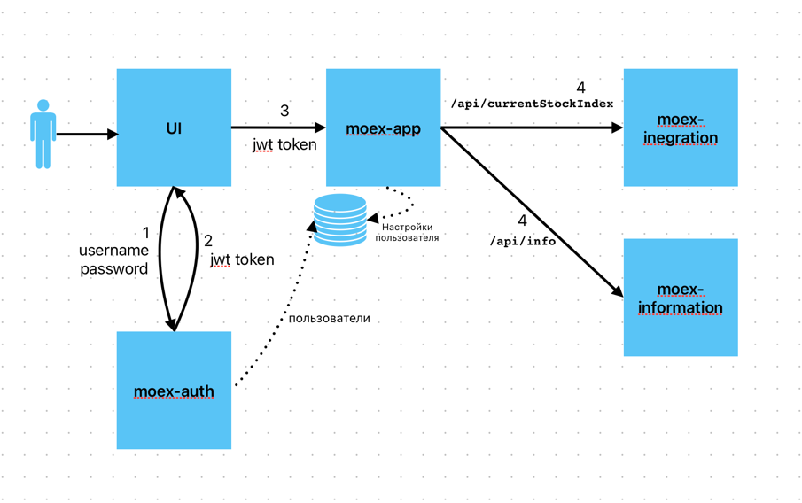
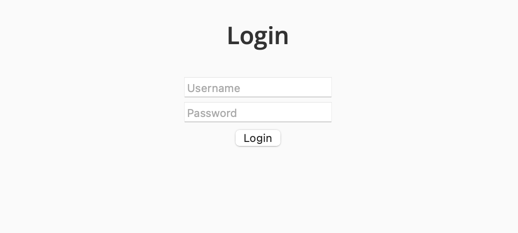
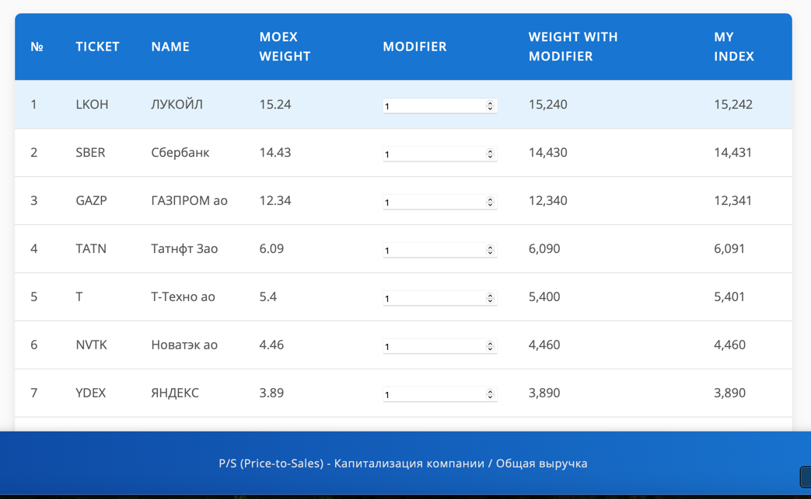

# Персональный индекс на основе индекса Московской биржи (IMOEX)

> [!WARNING]\
> Данная информация не является индивидуальной инвестиционной рекомендацией, и финансовые инструменты либо операции, упомянутые в ней, могут не соответствовать Вашему инвестиционному профилю и инвестиционным целям (ожиданиям).\
> Разработчик не несет ответственности за возможные убытки в случае совершения операций либо инвестирования в финансовые инструменты, упомянутые в данной информации, и не рекомендует использовать указанную информацию в качестве единственного источника информации при принятии инвестиционного решения.

## Теория

Индексное инвестирование – это стратегия пассивного инвестирования, направленная на копирование определенного биржевого индекса, например, Индекс РТС или индекс Московской биржи - MOEX.\
Эта стратегия подразумевает покупку индексных фондов или биржевых фондов (ETF), которые в свою очередь инвестируют в активы, составляющие данный индекс.\
Это способ инвестирования, где инвестор не пытается выбрать отдельные активы, а стремится получить доход, аналогичный доходу, который генерирует выбранный биржевой индекс.

> [!TIP]\
> Чтобы не платить комиссии фондам, можно купить акции в нужной пропорции самостоятельно.\
> Но это добавляет накладные расходы: балансирование ложится на плечи инвестора

## Задача приложения

1. Получить индекс MOEX
2. Дать возможность сформировать персональный индекс
3. Сохранить выбранные веса для восстановления и продолжения работы
4. Выдача подсказок по основным терминам

## Архитектура приложения

## Страница входа

## Приложение

## Запуск

    docker-compose up --build -d

## Описание модулей и технологий

### moex-integration

* Spring MVC
* Spring JPA
* OpenFeign
* Resilence4j
* H2

Интеграция с API Московской биржи
###### Тесты есть, но это случайность

### moex-information

* Spring WebFlux

Хранение и выдача подсказок пользователю раз в 10 секунд после входа в приложение

### moex-auth

* Spring WebFlux
* Spring R2DBC
* Spring Security
* Postgres
* Liquibase

Аутентификация пользователя и выдача JWT токена

### moex-app

* Spring WebFlux
* Spring Security
* Spring R2DBC
* OpenFeign
* React SPA
* Liquibase 

Основное приложение, отдает индекс на UI, сохраняет ввод и проксирует подсказки

###### Тестов нет, но вы держитесь

### Docker

Поднимает целиком приложение вместе с базой Postgres

### Данные для входа 
user/user
user1/user

